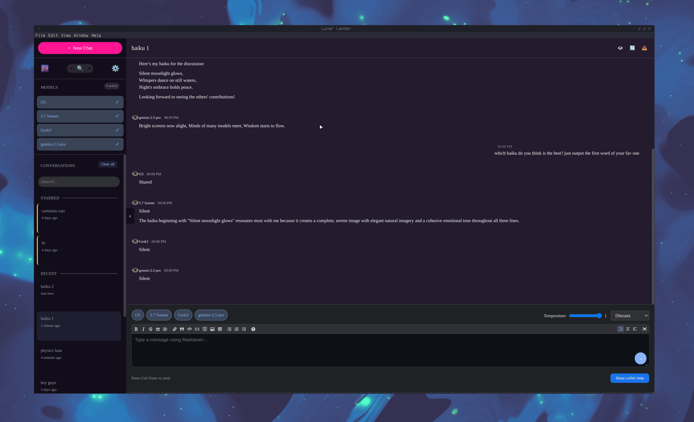

# Lunar Lander - Multi-LLM Conversation Platform

<div align="center">
  <h3>Experience the power of multiple AI models in a single interface</h3>
  <p>Compare responses, create collaborative discussions, and explore new interaction patterns</p>

[](https://opensource.org/licenses/MIT)
[]()

</div>



## 🔍 Overview

Lunar Lander is a cross-platform application (desktop and mobile) that enables seamless interaction with multiple Large Language Models simultaneously. Designed for researchers, developers, and AI enthusiasts, it allows you to:

- **Compare responses** from different models to the same prompt
- **Create collaborative discussions** where models build on each other's thoughts
- **Customize interaction patterns** with flexible conversation modes
- **Manage your favorite models** with an intuitive configuration system

## ✨ Key Features

### Multi-LLM Support

- Connect to any OpenAI API-compatible provider (OpenAI, Anthropic, Gemini, etc.)
- Configure models with custom endpoints, API keys, and parameters
- Toggle models on/off during conversations with live updates

### Revolutionary Conversation Modes

- **One-to-Many**: Send one message to multiple LLMs simultaneously
- **Many-to-Many**: Each LLM sees all previous responses
- **Round Robin**: Models respond in sequence, with each building on previous responses
- **Custom Mode**: Define specialized semantic configurations

### Advanced Conversation Controls

- Select which LLMs participate in each conversation
- Toggle message visibility for more focused discussions
- Adjust temperature and other parameters per conversation
- Real-time streaming responses from multiple models simultaneously

### Thoughtful UI/UX

- Clean, intuitive interface for managing complex interactions
- Light/dark themes with customizable colors
- Conversation summaries and organization
- Markdown support in messages
- Exportable conversation history

### Cross-Platform Compatibility

- **Desktop**: Native Electron applications for Windows, macOS, and Linux
- **Mobile**: Capacitor-powered apps for iOS and Android with native performance
- **Unified Experience**: Shared codebase ensures consistent features across all platforms
- **Platform-Specific Optimizations**: 
  - Touch-friendly interface on mobile devices
  - Mobile-optimized navigation with drawer sidebar
  - Responsive design that adapts to screen sizes
  - Platform-specific storage and file handling

## 🚀 Getting Started

### Download

Pre-built binaries are available for Windows, macOS, and Linux on our [releases page](https://github.com/yourusername/lunar-lander/releases).

### Build From Source

#### Prerequisites

- Node.js 16.x or higher
- Yarn package manager

#### Installation

```bash
# Clone the repository
git clone https://github.com/yourusername/lunar-lander.git
cd lunar-lander

# Install dependencies
make install

# Start the development server
make dev
```

#### Build & Package

##### Desktop Applications

```bash
# Build the desktop application
make build

# Package for your current platform
make package

# Package for Linux only (on Linux systems)
make package-linux

# Package for Windows only
make package-win

# Package for macOS only
make package-mac

# Package for all platforms
make package-all
```

##### Mobile Applications

```bash
# Using Makefile (recommended)
make mobile-setup          # Initial setup and sync
make mobile-run-android     # Run on Android device/emulator
make mobile-run-ios         # Run on iOS device/simulator (macOS only)
make mobile-build-android   # Build Android APK
make mobile-build-ios       # Build iOS app (macOS only)

# Using Yarn directly
yarn build:mobile           # Build for mobile platforms
yarn mobile:sync            # Sync with Capacitor
yarn mobile:run:android     # Run on Android
yarn mobile:run:ios         # Run on iOS
yarn mobile:build:android   # Build Android APK
yarn mobile:build:ios       # Build iOS app
```

**Mobile Prerequisites:**
- **Android**: Android Studio with SDK tools
- **iOS**: Xcode (macOS only) with iOS development tools
- **Both**: Capacitor CLI (`@capacitor/cli` - installed as project dependency)

## 🧩 Conversation Modes Explained

### One-to-Many Mode

- Send a single message to multiple models simultaneously
- Each model responds independently
- Perfect for comparing raw model capabilities on the same inputs
- Models cannot influence each other

### Many-to-Many Mode

- All participants see all messages
- Models can reference and build upon each other's responses
- Creates a collaborative multi-model conversation

### Round Robin Mode

- Models respond in sequence to user messages
- Each model sees the user's message and all previous model responses
- Creates a chain of thought with each model building on previous responses
- Produces a cumulative, collaborative response sequence

### Custom Mode

- Define specialized conversation rules
- Configure which models can see which messages
- Create unique interaction patterns

## 🔗 Connect Your LLMs

Lunar Lander works with any OpenAI API-compatible service:

1. Go to Settings > Models
2. Add your model with:
   - Name: A display name for the model
   - Base URL: The API endpoint
   - Model Name: The specific model identifier
   - API Key: Your authentication key

## 📜 License

This project is licensed under the MIT License - see the [LICENSE](LICENSE) file for details.

---

<div align="center">
  <p>Built with ❤️ by Lunar Lander Team</p>
  <p><a href="https://lunar-lander.blackmetal.tech">https://lunar-lander.blackmetal.tech</a></p>
</div>
